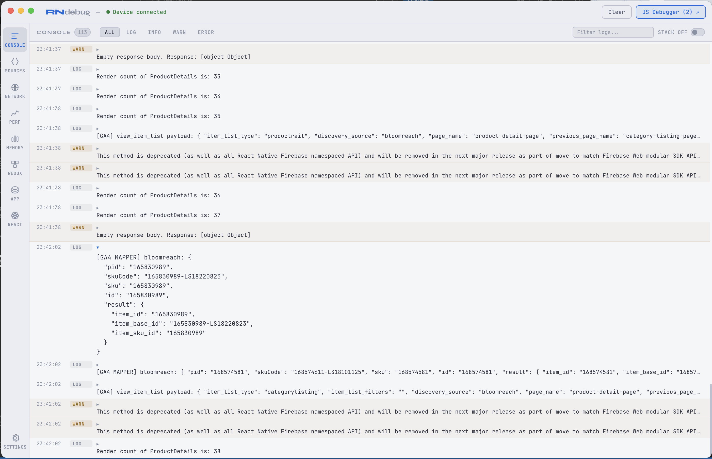
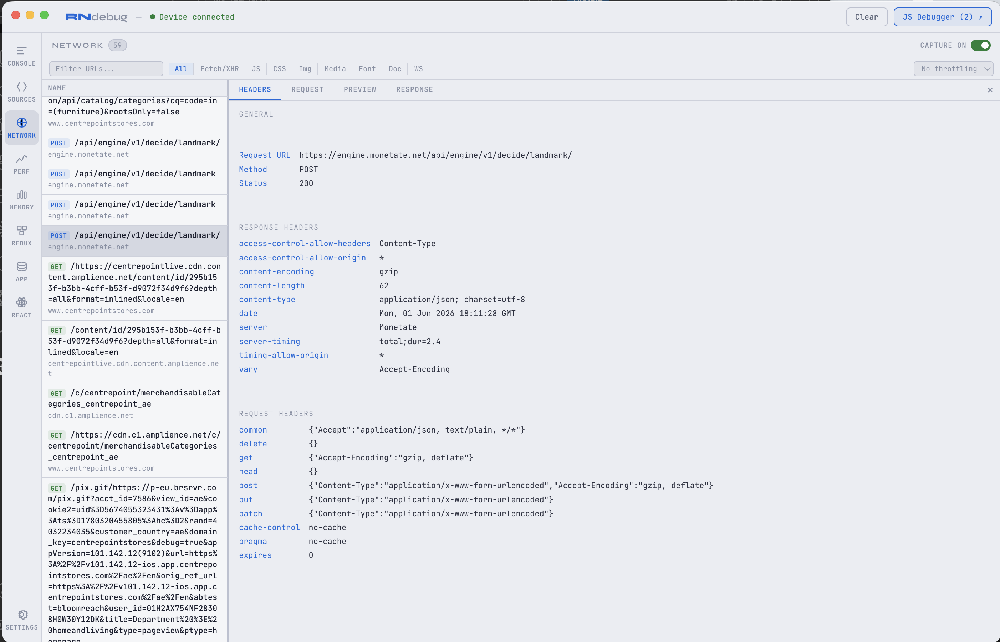

# RN Debugger

<p align="center">
  <b>A standalone macOS app for debugging React Native apps</b>
  <br/>
  <i>Supports React Native 0.74+ with Hermes, New Architecture, and latest versions</i>
</p>

<p align="center">
  
  
  
  
  
  
</p>

---

> The original [React Native Debugger](https://github.com/jhen0409/react-native-debugger) only supports the old Remote Debugger and doesn't work with Hermes / JSI / New Architecture. **This app is the modern replacement** — built from scratch to work with the latest React Native versions.

## Screenshots

### Console — Interactive Log Viewer
<p align="center">
  
</p>

*Collapsible object trees, level filters (Log/Info/Warn/Error), search, right-click to copy*

### Network — Chrome DevTools-style Inspector
<p align="center">
  
</p>

*Resizable/sortable columns, request/response detail, Copy as cURL, throttling*

## What's included

- **Console** — Interactive log viewer with collapsible object trees (Chrome DevTools-like), level filters, caller file:line display
- **Network Inspector** — Chrome DevTools-style network panel with resizable/sortable columns, search, type filters, throttling (Fast 3G / Slow 3G / Offline), Copy as cURL
- **Performance** — Live FPS meter, JS Thread timing, UI Thread timing with real-time sparkline graphs
- **Memory** — JS Heap Used/Total, Native Memory gauges from Hermes runtime
- **Redux DevTools** — Action list with time travel (Prev/Next), State/Diff/Action tabs with previous/current/next action context
- **AsyncStorage Inspector** — Live key/value browser with search
- **React DevTools** — Component tree and props inspector via `react-devtools-core` relay

## Installation

### Using npx (recommended)

No install needed — run directly from your React Native project:

```bash
npx rn-debugger setup     # Install SDK into your RN project
npx rn-debugger            # Launch the debugger app
```

### Using npm (global)

```bash
npm install -g rn-debugger-app
rn-debugger setup
rn-debugger
```

### Using Homebrew (macOS)

```bash
brew install --cask rn-debugger
```

### Download prebuilt binary

Download the `.dmg` from the [Releases](https://github.com/sharanagouda/react-native-debugger/releases) page.

### Build from source

```bash
git clone https://github.com/sharanagouda/react-native-debugger.git
cd rn-debugger-app
npm install
npm start
```

## React Native Compatibility

| RN Debugger | React Native | Engine | Architecture |
|---|---|---|---|
| v1.0+ | 0.74 — 0.81+ | Hermes | Old & New Architecture |

This app does **not** use the legacy Remote Debugger. It connects via WebSocket bridges and Chrome DevTools Protocol (CDP), which is the standard debugging interface for Hermes.

## Quick Start

### 1. Setup (one time, from your RN project directory)

```bash
npx rn-debugger setup
```

This automatically:
- Copies `RNDebugSDK.js` into your project (`src/debug/`)
- Detects your platform (iOS Simulator / Android Emulator / device) and sets the correct HOST
- Patches `index.js` to load the SDK in `__DEV__` mode
- Detects Redux (Toolkit or legacy) and wires the debug middleware
- Runs `adb reverse` for Android (if emulator/device detected)
- Adds the SDK to `.gitignore`

### 2. Launch the debugger

```bash
npx rn-debugger
```

### 3. Run your React Native app

```bash
npx react-native run-ios    # or run-android
```

Console logs, network requests, Redux actions, and AsyncStorage data flow into the debugger automatically.

### 4. Uninstall

```bash
npx rn-debugger remove
```

Clean removal — removes SDK file, patches from `index.js`, Redux wiring, and `.gitignore` entry.

## Add to your project scripts

```json
{
  "scripts": {
    "debug:setup": "npx rn-debugger setup",
    "debug:start": "npx rn-debugger",
    "debug:remove": "npx rn-debugger remove"
  }
}
```

Then every developer on your team runs:

```bash
npm run debug:setup    # one time
npm run debug:start    # every time
```

## Documentation

### Console

- Intercepts `console.log`, `console.warn`, `console.error`, etc.
- Objects render as collapsible trees with syntax highlighting
- Caller file:line shown at the end of each log row
- Level filters: All / Log / Info / Warn / Error
- Click to expand, right-click to copy message/JSON/caller
- `Cmd+K` clears the active tab

### Network Inspector

| Feature | Details |
|---|---|
| **Columns** | Name, Status, Type, Initiator, Size, Time, Waterfall — all resizable and sortable |
| **Search** | Filter by API URL in real time |
| **Type filters** | All, Fetch/XHR, JS, CSS, Img, Media, Font, Doc, WS |
| **Throttling** | No throttling, Fast 3G (500ms), Slow 3G (2s), Offline |
| **Detail view** | Click a row → Headers / Request / Preview / Response tabs overlay on the right |
| **Copy as cURL** | Right-click any request → Copy as cURL / Copy URL / Copy Response |
| **Request body** | Rendered as collapsible object tree (not raw JSON) |
| **Preview** | Response as interactive object tree, right-click to copy |
| **Capture toggle** | ON/OFF switch to pause/resume network capture |

Supports `fetch`, `XMLHttpRequest`, and `axios` (including `axios.create()` instances).

### Redux DevTools

- Captures every dispatched action and the resulting state snapshot
- **Time travel**: Step forward/backward through state history
- **State tab**: Full state tree with syntax highlighting
- **Diff tab**: Line-by-line diff against previous state
- **Action tab**: Previous / Current / Next actions with payloads

Wire Redux with one line:

```js
// Redux Toolkit
middleware: (getDefault) =>
  __DEV__ ? getDefault().concat(require('./src/debug/RNDebugSDK').reduxMiddleware) : getDefault(),

// Legacy Redux
if (__DEV__) middleware.push(require('./src/debug/RNDebugSDK').reduxMiddleware);
```

### AsyncStorage Inspector

- Live key/value browser
- Search keys
- Values rendered as formatted JSON
- Auto-updates when your app reads/writes AsyncStorage

### Performance

- **FPS** — Frames per second via `requestAnimationFrame` counter
- **JS Thread** — JavaScript thread frame timing
- **UI Thread** — Native UI thread timing
- Real-time sparkline graphs
- Data sent every 2 seconds from the SDK

### Memory

- **JS Heap Used** — Current JavaScript heap usage
- **JS Heap Total** — Total allocated heap
- **Native Memory** — Native heap from Hermes runtime
- Powered by `HermesInternal.getRuntimeProperties()`

### Network Throttling

Simulates slow network conditions on the device:

| Profile | Behavior |
|---|---|
| No throttling | Normal speed |
| Fast 3G | 500ms artificial delay on every request |
| Slow 3G | 2000ms delay |
| Offline | All requests immediately rejected |

### Dark / Light Mode

Toggle via Settings tab or `Cmd+Shift+T`. Persists across restarts.

## Keyboard Shortcuts

| Shortcut | Action |
|---|---|
| `Cmd+K` | Clear all panels |
| `Cmd+D` | Open JS Debugger (CDP DevTools with breakpoints) |
| `Cmd+R` | Open React DevTools |
| `Cmd+Shift+T` | Toggle Dark / Light mode |
| `Cmd+C` | Copy selected text |
| `Cmd+V` | Paste into filter/search |
| `Cmd+A` | Select all |

## Ports

| Port | Service |
|---|---|
| 9090 | Redux bridge |
| 9091 | AsyncStorage bridge |
| 9092 | Console + Network + Performance bridge |
| 8097 | React DevTools relay |
| 8081 | Metro bundler (CDP) |

Change ports in both `main.js` and `RNDebugSDK.js` if conflicts arise.

## Android Setup

For Android emulator, the setup command runs `adb reverse` automatically. For physical devices, ensure your Mac and device are on the same network and set the HOST in `src/debug/RNDebugSDK.js` to your Mac's LAN IP.

```bash
# Manual adb reverse (if needed)
adb reverse tcp:9090 tcp:9090
adb reverse tcp:9091 tcp:9091
adb reverse tcp:9092 tcp:9092
adb reverse tcp:8097 tcp:8097
```

## Troubleshooting

| Problem | Solution |
|---|---|
| App won't launch from VS Code terminal | Run: `unset ELECTRON_RUN_AS_NODE && npx rn-debugger` |
| Device status shows "Waiting..." | Check HOST in `src/debug/RNDebugSDK.js`. iOS sim: `127.0.0.1`, Android emu: `10.0.2.2` |
| Network tab empty | Run Metro with `--reset-cache`. Ensure Reactotron has `networking: false` |
| `XHRInterceptor.js does not exist` | Set `networking: false` in ReactotronConfig.js |
| Metro crashes with WebSocket error | Update to latest version — CDP polling was replaced with on-demand fetching |
| Console shows `apply (native)` as caller | Update SDK with `npx rn-debugger setup` |


## How it works

```
┌─────────────────────────────────────────────────────┐
│               macOS Electron App                    │
│                                                     │
│  Console │ Network │ Perf │ Memory                   │
│  Redux │ App (AsyncStorage) │ React │ Settings      │
│                                                     │
│  main.js                                            │
│   ├─ WS Server :9092  ← console + network + perf   │
│   ├─ WS Server :9090  ← redux actions + state      │
│   ├─ WS Server :9091  ← asyncstorage mutations     │
│   ├─ WS Relay  :8097  ← react-devtools bridge      │
│   └─ HTTP      :8081  → Metro CDP (on-demand)       │
└──────────────────────┬──────────────────────────────┘
                       │ WebSocket
┌──────────────────────┴──────────────────────────────┐
│             Your React Native App                   │
│                                                     │
│  RNDebugSDK.js (loaded in __DEV__ only)             │
│   ├─ console.* interceptor                          │
│   ├─ XHR constructor wrapper (catches axios + fetch)│
│   ├─ FPS + memory metrics                           │
│   ├─ Network throttle support                       │
│   ├─ Redux middleware                               │
│   └─ AsyncStorage watcher                           │
└─────────────────────────────────────────────────────┘
```

## Credits

- [Electron](https://www.electronjs.org/) — Desktop app framework
- [React DevTools](https://github.com/facebook/react/tree/main/packages/react-devtools) — React component inspector
- [Redux DevTools](https://github.com/reduxjs/redux-devtools) — Inspiration for Redux time travel
- [React Native Debugger](https://github.com/jhen0409/react-native-debugger) — The original that inspired this project

## Contributing

Contributions are welcome! Whether it's bug fixes, new features, documentation improvements, or UI enhancements — all PRs are appreciated.

```bash
git clone https://github.com/sharanagouda/react-native-debugger.git
cd react-native-debugger
npm install
npm start
```

### How to contribute

1. Fork the repository
2. Create your feature branch (`git checkout -b feature/amazing-feature`)
3. Commit your changes (`git commit -m 'feat: add amazing feature'`)
4. Push to the branch (`git push origin feature/amazing-feature`)
5. Open a Pull Request

### Ideas for contribution

- Windows/Linux support
- Source file browser with breakpoints
- React Native New Architecture profiling
- Flipper plugin compatibility layer
- Custom themes
- Keyboard shortcut customization

See [STATUS.md](./STATUS.md) for detailed technical documentation and architecture overview.

## License

[MIT](./LICENSE)
